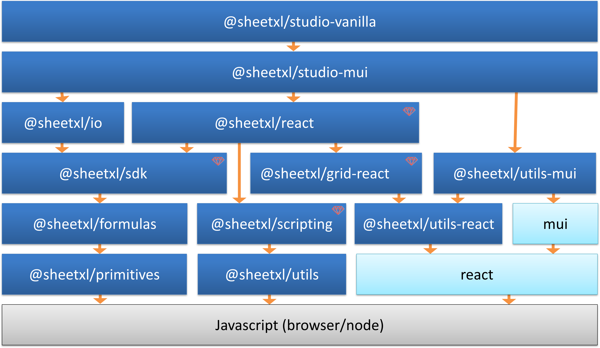

# SheetXL — the api-first spreadsheet

<p align="center">
  
  
</p>

[](https://discord.gg/NTKdwUgK9p)
[](https://www.npmjs.com/package/@sheetxl/studio-mui)
[](https://www.npmjs.com/package/@sheetxl/studio-mui)

### The full stack spreadsheet — for developers

**SheetXL is the open spreadsheet ecosystem** — modular, embeddable, and fully scriptable.

**Excel-compatible. API-first. Built for speed.**

If you like SheetXL **[give us a star ⭐](https://github.com/sheetxl/sheetxl)** and help others find us!

Whether you're building a custom UI, adding live scripting, or integrating spreadsheet logic into your app, SheetXL
gives you full control with zero platform lock-in.


*Headless API. Live Scripting. CLI Tools. Built for developers.*

### Try it now — Complete Excel-compatible App

👉 [See a full SheetXL demo](https://demo.sheetxl.com)

## 🚀 Getting Started

Get started in minutes with our production ready application.

### 1. Installation

```bash
# Using npm
npm install @sheetxl/sdk @sheetxl/studio-mui @mui/material @emotion/react @emotion/styled

# Using yarn
yarn add @sheetxl/sdk @sheetxl/studio-mui @mui/material @emotion/react @emotion/styled
```

### 2. Basic Usage

```javascript
import React from 'react';
import { Studio } from '@sheetxl/studio-mui';

function App() {
  // Studio will fill it's parent container.
  return (
    <div style={{ height: '600px', width: '100%' }}>
      <Studio />
    </div>
  );
}
```

For more advanced setup options, check out our full
[Getting Started Guides](https://www.sheetxl.com/docs/guides/category/getting-started).

### 📚 Ecosystem Overview

The SheetXL ecosystem is modular by design. You can use only what you need — or compose it all together.

### SDK

At the core of the ecosystem is a **headless, high-performance SDK** [`@sheetxl/sdk`](https://www.npmjs.com/package/@sheetxl/sdk),
built to power everything from lightweight grid widgets to massive enterprise-scale calculation engines

Key features:

* **Blazing Speed:** Executes 10M+ operations per second and handles spreadsheets with 17B+ cells.
* **Powerful API:** A modern, vectorized, range-based API for precise, scriptable control over data — independent of any UI.

### Applications and UI Toolkits

Build UIs your way — from plug-and-play dashboards to fully custom design systems.

* **Rapid Deployment** [`@sheetxl/studio-mui`](https://www.npmjs.com/package/@sheetxl/studio-mui): A complete, open-source spreadsheet UI with Excel-grade features. Ready to ship.
* **Custom Interface** [`@sheetxl/react`](https://www.npmjs.com/package/@sheetxl/react): A flexible component and hook library for deep customization.

### I/O Connectors

Easily load and save workbooks in popular formats:

* `xlsx` (Excel)
* `csv`
* `parquet` (in progress)
* `json` (native format)

<details>
<summary><b>Click to see the a detailed overview of all modules...</b></summary>



`Items marked with 💎 are part of the premium licensing.`

| Category     | Module                  | Description                 | License |
|--------------|-------------------------|-----------------------------|---------|
| Core         | @sheetxl/sdk 💎        | Headless spreadsheet API    | Commercial |
|              | @sheetxl/formulas       | Collection of 400+ formulas | MIT |
|              | @sheetxl/primitives     | Low level types (Scalar, IRange) | MIT |
|              | @sheetxl/scripting 💎  | Scripting engine and compiler | Commercial |
| IO           | @sheetxl/io             | Import/export (xlsx, csv, json) | MIT |
| Applications | @sheetxl/studio-vanilla | Framework-agnostic spreadsheet app | MIT |
|              | @sheetxl/studio-mui     | Spreadsheet app powered by React/MUI | MIT |
| UI Toolkits  | @sheetxl/react 💎      | Spreadsheet React UI components and hooks | Commercial |
|              | @sheetxl/grid-react 💎 | Lightweight, standalone React data grid | Commercial |
| Utils        | @sheetxl/utils          | Headless utilities (math, ranges, etc) | MIT |
|              | @sheetxl/utils-react    | React UI helpers | MIT |
|              | @sheetxl/utils-mui      | MUI UI helpers (color picker, dialogs, etc) | MIT |

</details>

## Key Features

SheetXL is built on four core pillars: extreme performance, deep Excel compatibility, unparalleled developer power, and a modern, extensible architecture.

* **Performance & Scale**

  Process 10M+ ops/second and manage massive 17B+ cell workbooks, all in-browser.

* **True Excel Fidelity**

  Go beyond basic formulas. Get the Excel-grade features your users demand, from tables and charts to cross-sheet copy/paste.

* **Unmatched Developer Power**

  With a headless core, a powerful vectorized API, and a built-in scripting engine, you have the ultimate control to build any experience.

* **Modern, Open Architecture**

  Built with TypeScript and a flexible plugin model, including a fully open-sourced MIT-licensed MUI design system.

## 🔥 Power Features

### Live Scripting Engine

Write and execute TypeScript/JavaScript directly inside your spreadsheet. Perfect for complex data transformations, custom validation, and real-time calculations.


### Command-Line Interface

Automate spreadsheet operations, run batch processes, and integrate SheetXL into your build pipeline with our full-featured CLI.


```bash
# Extract data from any Excel file
sheetxl extract data.xlsx A1:Z100

# Run custom scripts
sheetxl run process-data.ts --workbook sales.xlsx
```

### 🏷️ User Features

* 17B+ cells (The same as Excel)
* 400+ Excel-compatible formulas
* Full fidelity Excel import/export
* Scripting Engine
* Fast. Autofill 1,048,576 rows with formulas in 0.7s (10M+ formulas/second)

<details>
<summary><b>Click to see the full list of additional User Features...</b></summary>

* Formatted Copy/Paste (Compatible with Microsoft Excel and Google Sheet)
* Hidden Rows/Columns
* Frozen Rows/Columns
* Resizable, Auto-fit Rows/Columns
* Office Theme (Color Picker, Theme Selector)
* Cell Styles (Themes and Formatting)
* Preset Cell Style Selector
* Overflow, Word-wrap
* Borders
* Tables
* Drawings
* Multi-range selection
* Merged Cells
* Autofill
* Keyboard Accessible Support for all Excel shortcut keys
* Undo/Redo
* Find/Replace
* Sort
* Zoom
* Hyperlinks
* Mobile Friendly (Touch / Small screen accommodation)

</details>

### 🛠️ Developer Features

* Typescript
* Easy Integration

<details>
<summary><b>Click to see the full list of Developer Features...</b></summary>

* Built in scripting & Formula support.
* Built from the ground up using React and CSS-in-JS components.
* Fully functional MIT Open-sourced Material-UI Application.
* Headless spreadsheet API can be used without UI and on server or as library.
* Easily extend functions with simple registration.

</details>

## Roadmap

* Table Filtering (in progress)

<details>
<summary><b>🧭 Click to see the full Roadmap...</b></summary>

### 2025 Roadmap

* Conditional formatting
* Full Styling in Excel Export
* Full Charting (nearly complete)
* Multi-key shortcuts
* Pivot
* Sparklines
* Slicer/Timeline
* Accessibility <https://www.w3.org/TR/WCAG21/>
* Printing

### 2026 Roadmap

* Google Sheets Interop
* Collaboration

</details>

## 🤔 Why SheetXL?

We believe developers have been forced to compromise between powerful but closed spreadsheet apps and flexible but limited data grids for too long. SheetXL was built to end that compromise.

### Why not just a spreadsheet app?

Importing and Exporting data from a spreadsheet is a broken part of nearly every business workflow. Instead of
importing/exporting data, just import the spreadsheet.

* Reduce errors on data due to import/export copying of data.
* Real time integration/validation of your data.
* Complete control of data as your data never leaves your systems.
* Improved user productivity.
* Combine custom user enhancements with flexible data manipulation.

### Why not just a spreadsheet component?

As a Microsoft Excel user and a React developer I have always wanted a solution that combines the flexibility and ease of use of Excel with the control and specific capabilities of my custom application.

I wanted my custom applications to have spreadsheet features!

Several great spreadsheet components exists but none of them have:

* Excel compatibility and features.
* Simple integration.
* Billions of cells.
* Comprehensive support for keyboard shortcuts (e.g. tabbing within multi-selected ranges, arrow-keys within cells).
* Enable advanced copy / paste between Excel/Excel Online/Google Sheets.
* Easily extendable libraries that use open-source and modern design patterns.
* Real-time integration to data providing a single source of truth; no copying data between systems using complex APIs.

## The Competitive Landscape

We encourage you to explore the landscape. We're confident you'll see why we built SheetXL.

<details>
<summary><b>👐 Open-source Spreadsheets Components...</b></summary>

* <https://dream-num.github.io/LuckysheetDemo/> <https://github.com/dream-num/Luckysheet> (14,500 :star:)
* <https://github.com/jspreadsheet/ce>  <https://jspreadsheet.com/v8> (6,400 :star:)
* <https://github.com/myliang/x-spreadsheet> <https://myliang.github.io/x-spreadsheet> (13,500 :star:)
* <https://github.com/nadbm/react-datasheet> <https://nadbm.github.io/react-datasheet> (5,300 :star:)
* <https://github.com/adazzle/react-data-grid> (6,200 :star:)
* <https://iddan.github.io/react-spreadsheet> (1,000 :star:)

</details>

<details>
<summary><b>💲 Paid Spreadsheets Components...</b></summary>

* <https://demos.devexpress.com/ASPxSpreadSheetDemos/Features/Charts.aspx>
* <https://www.igniteui.com/spreadsheet/overview> <https://www.infragistics.com/products/ignite-ui-jquery/grids-and-lists/spreadsheet>
* <https://ej2.syncfusion.com/react/demos/#/bootstrap5/spreadsheet/default>
* <https://webix.com/demos/spreadsheet>

</details>

<details>
<summary><b>💲 Paid Data-grids...</b></summary>

A data-grid is a sub-component within a spreadsheet that provides base grid-level rendering but without many of the
spreadsheet features (user styling, formulas, Excel compatibility, etc). Features vary by product but generally
include sorting, filtering, grouping, and basic cell editing.

* <https://handsontable.com/demo> (18,100 :star:)
* <https://www.ag-grid.com/example> (10,500 :star:)
* <https://mui.com/x/react-data-grid> (6,100 :star:)
* <https://www.datagridxl.com/>

</details>

<details>
<summary><b>💲 SAAS Spreadsheets...</b></summary>

SAAS spreadsheets are still closed solutions and lack the full experience of Excel.

* <https://www.equals.app>
* <https://www.rows.com>
* <https://www.quadratichq.com/>
* <https://sourcetable.com//>

</details>

## 🙏 Credits / 🎉 Special Thanks

* [Formula.js](https://formulajs.info) (For function references)
* [Fast Formula Parser](https://github.com/LesterLyu/fast-formula-parser) (For grammar support)
* [SheetJS](https://sheetjs.com) (For original number format parsing and Excel import/export)
* [Papa Parse](https://www.papaparse.com) (For CSV parsing)

## 🔗 Learn More

Whether you're ready to build, need help, or just want to see more examples, here's where to go next.

* 💬 **[Join our Discord Community](https://discord.gg/NTKdwUgK9p)** - Get help and connect with the
* ⭐ **[Star us on GitHub](https://github.com/sheetxl/sheetxl)** - If you like SheetXL give us a star ⭐ and help others find us!
* 📘 **[Developer Docs](https://www.sheetxl.com/docs/guides)** - Guides and tutorials.
* 🔌 **[API Reference](https://api.sheetxl.com)** - Detailed documentation for all packages.
* 👀 **[Live Demo Gallery](https://www.sheetxl.com/demos)** - A showcase of interactive examples.
* 🖼️ **[Storybook](https://storybook.sheetxl.com)** - Explore and test individual UI components.
team.
* 🌐 **[Website](https://www.sheetxl.com)** - Our Website.

---
