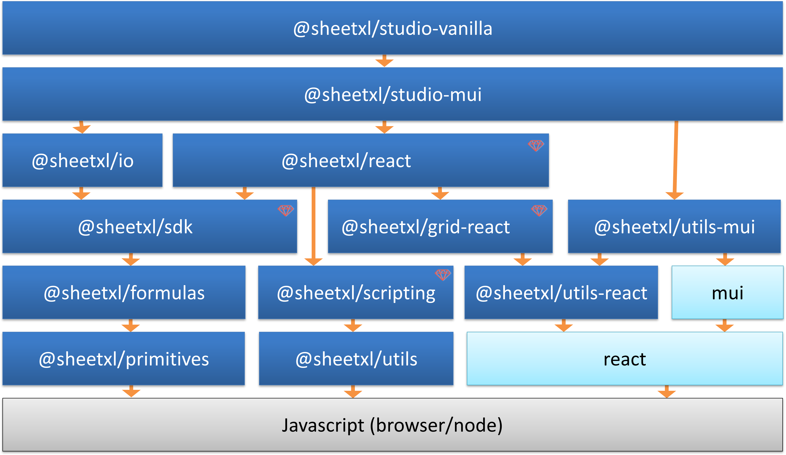

SheetXL is structured as a modular ecosystem of packages, each with a clear and specific purpose.

This architecture was chosen intentionally to give you maximum flexibility and control. It allows
you to build your application with only the necessary components, ensuring a minimal footprint
and a clean dependency tree. For example, you can use the `@sheetxl/grid` package on its own without
the overhead of the full spreadsheet engine.

The packages below are designed for seamless interoperability and are grouped into Core, UI, and Utilities to help you find the right tool for the job.

| Module     | Description | License |
|------------|------|----|
| @sheet/sdk | Head-less library for interacting with a spreadsheet.  | Commercial |
| @sheetxl/studio-mui  | A fully functional application that can be easily embedded and/or extended using Material-UI and React. | MIT |
| @sheet/react  | React spreadsheet components. | Commercial |
| @sheet/io  | Head-less library for importing and exporting into SheetXL file format | MIT |
| @sheet/grid  | A react data grid that provides basic grid capabilities.  | Commercial |
| @sheet/utils-mui  | A set of mui-based components that may be used in any application setting. (e.g. color picker).  | MIT |
| @sheet/utils-react  | A set of react-base components may be used in any application setting. (e.g. movable panel, keystroke management).  | MIT |
| @sheet/utils  | A set of headless utilities may be used in any application setting. | MIT |

`Items marked with 💎 are commercially licensed.`

* [React](https://react.dev/) and [@mui/material](https://mui.com/core/) are 3rd party dependencies (and awesome 🔥).